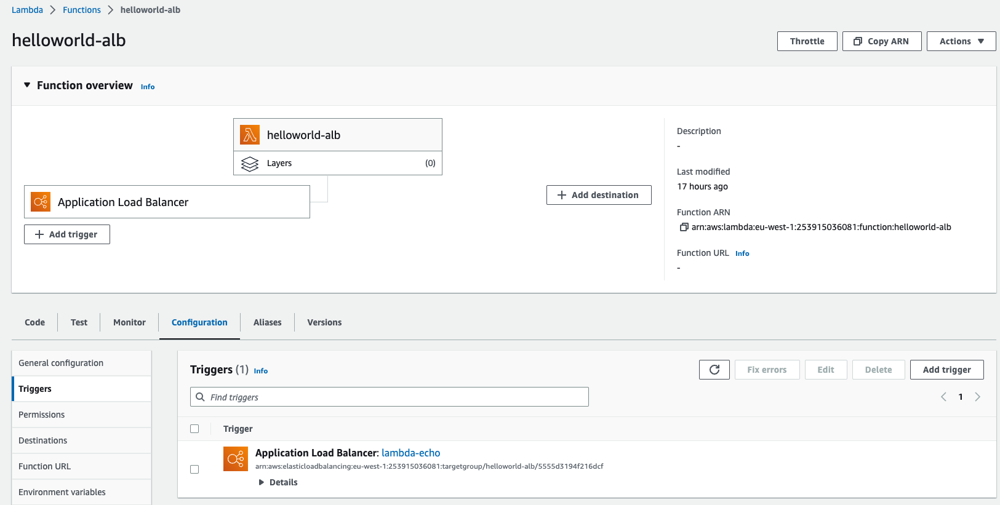
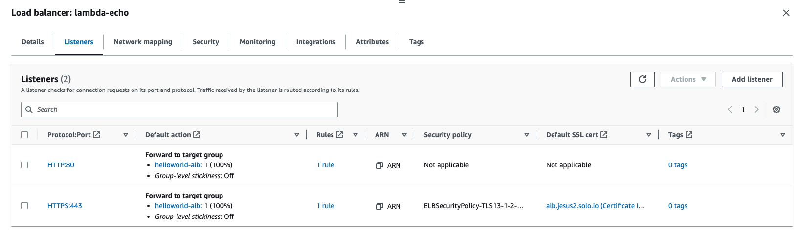
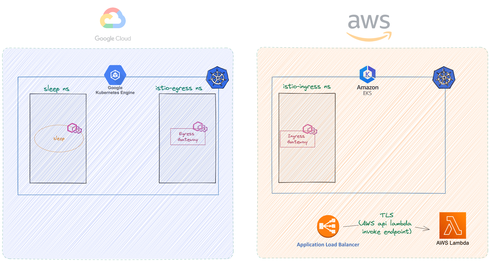
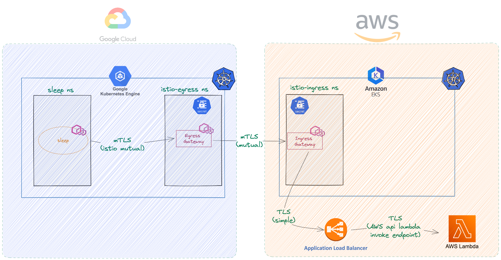

# <center>Sharing resources between AWS and GCP using Istio</center>

## Table of Contents
* [0 - Introduction](#introduction)
* [1 - Create the lambda function](#lab-1---create-lambda-function-)
* [2 - Deploy Istio in an EKS cluster](#lab-2---deploy-istio-eks-)
* [3 - Deploy Istio in a GCP cluster](#lab-3---deploy-istio-gcp-)
* [4 - Expose AWS endpoint using Istio mTLS](#lab-4---expose-endpoint-mtls-)
* [5 - Connect both clusters using Istio gateways and mTLS](#lab-5---connect-clusters-mtls-)
* [6 - Testing the connection from a pod in GKE](#lab-6---testing-connection-)

## Introduction <a name="introduction"></a>

In the modernization journey to cloud-native architectures, you will eventually find that a multicloud architecture is a natural step.

Cost saving, vendor lock-in, versatility, HA, name your reason, this is a reality that we see more and more from the experience helping customers in production.

In this blog post we will learn how to make an AWS lambda function available to our applications running in GCP, using different Istio meshes and securing the traffic over the wire.


## 1 - Create the lambda function<a name="lab-1---create-lambda-function-"></a>

We are going to create a lambda function and expose it with a [private ALB](https://docs.aws.amazon.com/lambda/latest/dg/services-alb.html), only available inside the AWS VPC.



The code for the lambda is really simple, you can even deploy it directly from [this repo](https://serverlessrepo.aws.amazon.com/applications/arn:aws:serverlessrepo:us-east-1:072567720793:applications~ALB-Lambda-Target-HelloWorld)
```python
def lambda_handler(event, context):
	response = {
		"statusCode": 200,
		"statusDescription": "200 OK",
		"isBase64Encoded": False,
		"headers": {
			"Content-Type": "text/html; charset=utf-8"
	    }
	}

	response['body'] = """<html>
	<head>
		<title>Hello World!</title>
		<style>
			html, body {
			margin: 0; padding: 0;
			font-family: arial; font-weight: 700; font-size: 3em;
			text-align: center;
		}
		</style>
	</head>
	<body>
		<p>Hello World from Lambda</p>
	</body>
</html>"""
	return response
```

After the function is created, we need to create an internal ALB and route all traffic to the lambda. There are many [tutorials](https://docs.aws.amazon.com/elasticloadbalancing/latest/application/lambda-functions.html) about this, but basically the steps are:

1. Create an internal ALB
2. On the navigation pane, under LOAD BALANCING, choose Target Groups.
3. Choose Create target group.
4. For Target group name, type a name for the target group.
5. For Target type, select Lambda function.
6. Register the Lambda function that is deployed earlier after you create the target group
7. Add a listener (or two) to the Load Balancer, forwarding all traffic to the target group

In the picture you can see a http listener and a https listener, using a certificate in ACM



As we said, it is not possible to call this function outside the AWS VPC
```shell
$ curl https://alb.jesus2.solo.io -v
*   Trying 10.0.1.186:443...
* connect to 10.0.1.186 port 443 failed: Operation timed out
*   Trying 10.0.2.117:443...
* connect to 10.0.2.117 port 443 failed: Operation timed out
*   Trying 10.0.3.223:443...
* After 74907ms connect time, move on!
* connect to 10.0.3.223 port 443 failed: Operation timed out
* Failed to connect to alb.jesus2.solo.io port 443 after 225096 ms: Couldn't connect to server
* Closing connection 0
curl: (28) Failed to connect to alb.jesus2.solo.io port 443 after 225096 ms: Couldn't connect to server
```

## 2 - Deploy Istio in an EKS cluster<a name="lab-2---deploy-istio-eks-"></a>

We are going to use an EKS cluster deployed in the same VPC as the ALB, so it is visible for the workloads running in that cluster.

Let's start by downloading the istioctl binary and deploy the Istio control plane, with some common options:

```yaml
export CLUSTER2=jesus-eks-eks-batch1-1
curl -L https://istio.io/downloadIstio | ISTIO_VERSION=1.17.2 sh -

# Istiod control-plane, minimal profile
istioctl --context ${CLUSTER2} install -r 1-17 -y -f -<<EOF
apiVersion: install.istio.io/v1alpha1
kind: IstioOperator
metadata:
  name: control-plane
spec:
  profile: minimal
  components:
    pilot:
      k8s:
        env:                                                                            
        # Pilot will send only clusters that referenced in gateway virtual services attached to gateway
        - name: PILOT_FILTER_GATEWAY_CLUSTER_CONFIG                                                  
          value: "true"
        # Certificates received by the proxy will be verified against the OS CA certificate bundle
        - name: VERIFY_CERTIFICATE_AT_CLIENT                                                  
          value: "true"
  meshConfig:              
    defaultConfig:       
      proxyMetadata:      
        # Enable basic DNS proxying
        ISTIO_META_DNS_CAPTURE: "true"
        # Enable automatic address allocation
        ISTIO_META_DNS_AUTO_ALLOCATE: "true"
    enablePrometheusMerge: true  
EOF

# Istiod service (no revision in the selector)
kubectl --context ${CLUSTER2} apply -f - <<EOF
apiVersion: v1
kind: Service
metadata:
  labels:
    app: istiod
    istio: pilot
    release: istio
  name: istiod
  namespace: istio-system
spec:
  type: ClusterIP  
  ports:
  - name: grpc-xds
    port: 15010
  - name: https-dns
    port: 15012
  - name: https-webhook
    port: 443
    targetPort: 15017
  - name: http-monitoring
    port: 15014
  selector:
    app: istiod
EOF
```

After that, we will see the istiod pod running

```shell
kubectl --context ${CLUSTER2} get po -n istio-system
NAME                           READY   STATUS    RESTARTS   AGE
istiod-1-17-6f5f489dd6-l6krg   1/1     Running   0          35s
```

As a best practice, we will now deploy the Istio Gateways using a different Operator, and in a different namespace:

```yaml
# Istio ingress gateway, empty profile, in a non-default namespace
kubectl --context ${CLUSTER2} create namespace istio-ingress
istioctl --context ${CLUSTER2} install -r 1-17 -y -f -<<EOF
apiVersion: install.istio.io/v1alpha1
kind: IstioOperator
metadata:
  name: istio-gateways
spec:
  profile: empty
  components:
    ingressGateways:
    - name: istio-ingressgateway
      namespace: istio-ingress
      enabled: true
EOF
```

After a few seconds, the Istio Ingress Gateway is configured and ready
```shell
istioctl --context ${CLUSTER2} proxy-status                          
NAME                                                    CLUSTER        CDS        LDS        EDS          RDS          ECDS         ISTIOD                           VERSION
istio-ingressgateway-57dc66d6ff-d2r75.istio-ingress     Kubernetes     SYNCED     SYNCED     NOT SENT     NOT SENT     NOT SENT     istiod-1-17-6f5f489dd6-l6krg     1.17.2
```

## 3 - Deploy Istio in a GCP cluster<a name="lab-3---deploy-istio-gcp-"></a>

Following a similar approach, we are going to use a GKE cluster (not connected in any way to the EKS) and deploy Istio there. Notice that both Istio installations will form independent meshes, not sharing any common root of trust.

```yaml
export CLUSTER1=gke-lab3

# Istiod control-plane, minimal profile
istioctl --context ${CLUSTER1} install -r 1-17 -y -f -<<EOF
apiVersion: install.istio.io/v1alpha1
kind: IstioOperator
metadata:
  name: control-plane
spec:
  profile: minimal
  components:
    pilot:
      k8s:
        env:
        # Pilot will send only clusters that referenced in gateway virtual services attached to gateway
        - name: PILOT_FILTER_GATEWAY_CLUSTER_CONFIG                                                  
          value: "true"
        # Certificates received by the proxy will be verified against the OS CA certificate bundle
        - name: VERIFY_CERTIFICATE_AT_CLIENT                                                  
          value: "true"
  meshConfig:              
    defaultConfig:       
      proxyMetadata:      
        # Enable basic DNS proxying
        ISTIO_META_DNS_CAPTURE: "true"
        # Enable automatic address allocation
        ISTIO_META_DNS_AUTO_ALLOCATE: "true"
    enablePrometheusMerge: true  
EOF

# Istiod service (no revision in the selector)
kubectl --context ${CLUSTER1} apply -f - <<EOF
apiVersion: v1
kind: Service
metadata:
  labels:
    app: istiod
    istio: pilot
    release: istio
  name: istiod
  namespace: istio-system
spec:
  type: ClusterIP  
  ports:
  - name: grpc-xds
    port: 15010
  - name: https-dns
    port: 15012
  - name: https-webhook
    port: 443
    targetPort: 15017
  - name: http-monitoring
    port: 15014
  selector:
    app: istiod
EOF

# Istio egress gateway, empty profile, in a non-default namespace
kubectl --context ${CLUSTER1} create namespace istio-egress
istioctl --context ${CLUSTER1} install -r 1-17 -y -f -<<EOF
apiVersion: install.istio.io/v1alpha1
kind: IstioOperator
metadata:
  name: istio-gateways
spec:
  profile: empty
  components:
    egressGateways:
    - name: istio-egressgateway
      namespace: istio-egress
      enabled: true
EOF
```

Let's also deploy a simple application in GKE, so we can use it to connect with the lambda at the end of this exercise

```yaml
kubectl apply --context ${CLUSTER1} -f - <<EOF
apiVersion: v1
kind: Namespace
metadata:
  name: sleep
---
apiVersion: apps/v1
kind: Deployment
metadata:
  name: sleep
  namespace: sleep
spec:
  replicas: 1
  selector: 
    matchLabels:
      app: sleep
      version: v1
  template:
    metadata:
      labels:
        app: sleep
        version: v1
        istio.io/rev: 1-17
    spec:
      containers:
      - name: sleep
        image: curlimages/curl
        command: ["/bin/sleep", "3650d"]
        imagePullPolicy: IfNotPresent
EOF
```

After a few seconds, the Istio Egress Gateway and the sleep app are configured and ready
```shell
istioctl --context ${CLUSTER1} proxy-status                          
NAME                                                  CLUSTER        CDS        LDS        EDS          RDS          ECDS         ISTIOD                           VERSION
istio-egressgateway-7c5f5dcfbb-vz5zh.istio-egress     Kubernetes     SYNCED     SYNCED     NOT SENT     NOT SENT     NOT SENT     istiod-1-17-6f5f489dd6-vh9zs     1.17.2
sleep-87549b8d9-622db.sleep                           Kubernetes     SYNCED     SYNCED     SYNCED       SYNCED       NOT SENT     istiod-1-17-6f5f489dd6-vh9zs     1.17.2
```

This how the system looks like now:


## 4 - Expose AWS endpoint using Istio mTLS<a name="lab-4---expose-endpoint-mtls-"></a>

The first thing that must be done is to include the ALB endpoint in the Istio registry, so we can call that external service from the Istio mesh

```yaml
kubectl apply --context ${CLUSTER2} -f - <<EOF
# The external service will be visible only from the Istio ingress gateway, no need to make it available to other workloads for now
apiVersion: networking.istio.io/v1beta1
kind: ServiceEntry
metadata:
  name: se-alb-ext
  namespace: istio-ingress
spec:
  exportTo:
    - .
  hosts:
    - alb.jesus2.solo.io
  ports:
    - name: https
      number: 443
      protocol: HTTPS
  resolution: DNS
---
# As we chose to connect using the ALB https listener, make sure you tell Istio it must use TLS for the connection
apiVersion: networking.istio.io/v1beta1
kind: DestinationRule
metadata:
  name: dr-alb-ext
  namespace: istio-ingress
spec:
  host: alb.jesus2.solo.io
  trafficPolicy:
    portLevelSettings:
      - port:
          number: 443
        tls:
          mode: SIMPLE
EOF
```

After this, we can expose the external service using a mTLS-protected listener in the gateway
```yaml
kubectl apply --context ${CLUSTER2} -f - <<EOF
apiVersion: networking.istio.io/v1beta1
kind: Gateway
metadata:
  name: eastwestgateway
  namespace: istio-ingress
spec:
  selector:
    app: istio-ingressgateway
    istio: ingressgateway
    istio.io/rev: 1-17
  servers:
    - hosts:
        - lambda.external
      port:
        name: https
        number: 443
        protocol: HTTPS
      tls:
        credentialName: mtls-credential
        # Notice that as we are connecting 2 unrelated Istio meshes, ISTIO_MUTUAL mode is not possible and we should be providing the certs in both sides, but this is fine.
        mode: MUTUAL
---
apiVersion: networking.istio.io/v1beta1
kind: VirtualService
metadata:
  name: vs-lambda
  namespace: istio-ingress
spec:
  exportTo:
    - .
  gateways:
    - eastwestgateway
  hosts:
    - lambda.external
  http:
    - match:
        - sourceLabels:
            app: istio-ingressgateway
            istio: ingressgateway
            istio.io/rev: 1-17
          uri:
            prefix: /
      route:
      # All traffic sent to lambda.external host will be forwarded to the ALB, in more complex scenarios we can even create a more elaborated routing
        - destination:
            host: alb.jesus2.solo.io
            port:
              number: 443
EOF
```

We can verify that a new route is available in the gateway
```shell
istioctl --context ${CLUSTER2} proxy-config routes deploy/istio-ingressgateway -n istio-ingress
NAME                                              DOMAINS             MATCH                  VIRTUAL SERVICE
https.443.https.eastwestgateway.istio-ingress     lambda.external     /*                     vs-lambda.istio-ingress
                                                  *                   /healthz/ready*        
                                                  *                   /stats/prometheus*     
```

Remember that we protected the route in the Gateway CR using a referenced secret. Let's create the mTLS secret pairs for both origin (Istio EgressGateway in GKE) and destination (Istio IngressGateway in EKS)

```bash
# create server certificates
openssl req -x509 -nodes -days 365 -newkey rsa:2048 \
   -keyout server.key -out server.crt -subj "/C=NT/ST=Zamunda/O=Solo.io/OU=Solo.io/CN=*"

# create client certificates
openssl req -x509 -nodes -days 365 -newkey rsa:2048 \
   -keyout client.key -out client.crt -subj "/C=NT/ST=Wakanda/O=Solo.io/OU=Solo.io/CN=*"

# make the certs available in origin gateway
kubectl --context ${CLUSTER1} create -n istio-egress secret generic mtls-credential \
  --from-file=key=client.key \
  --from-file=cert=client.crt \
  --from-file=cacert=server.crt

# make the certs available in destination gateway
kubectl --context ${CLUSTER2} create -n istio-ingress secret generic mtls-credential \
  --from-file=key=server.key \
  --from-file=cert=server.crt \
  --from-file=cacert=client.crt
```

Let's test it, using the certificated directly from a curl (it won't work without the certificates as the gateway would not accept the request)
```shell
export HOST_GW_CLUSTER2=$(kubectl --context ${CLUSTER2} -n istio-ingress get svc -l istio=ingressgateway -o jsonpath='{.items[0].status.loadBalancer.ingress[0].*}')
echo $HOST_GW_CLUSTER2
export IP_GW_CLUSTER2=$(dig +short ${HOST_GW_CLUSTER2} @8.8.8.8|tail -n1)
echo $IP_GW_CLUSTER2
curl --cert client.crt --key client.key --cacert server.crt https://lambda.external/get --resolve lambda.external:443:${IP_GW_CLUSTER2} -isk
```

And the result:
```shell
HTTP/2 200 
server: istio-envoy
date: Wed, 03 May 2023 17:54:54 GMT
content-type: text/html; charset=utf-8
content-length: 258
x-envoy-upstream-service-time: 496

<html>
        <head>
                <title>Hello World!</title>
                <style>
                        html, body {
                        margin: 0; padding: 0;
                        font-family: arial; font-weight: 700; font-size: 3em;
                        text-align: center;
                }
                </style>
        </head>
        <body>
                <p>Hello World from Lambda</p>
        </body>
</html>%
```

Half of the job is done! Now let's work in the GKE side to make this mTLS transparent to applications.

## 5 - Connect both clusters using Istio gateways and mTLS<a name="lab-5---connect-clusters-mtls-"></a>

Although it is possible to connect directly the GKE workloads with the EKS Ingress Gateway, this is not a nice way to do it, as we would be introducing too much complexity in the applications.

Let's isolate this complexity in an Istio Egress Gateway, which will take care of all the mTLS certificates and cross-cluster configuration.

First of all, define the EKS Istio Ingress Gateway as an External service, because from GKE POV, it is really external to us:
```yaml
kubectl apply --context ${CLUSTER1} -f - <<EOF
apiVersion: networking.istio.io/v1beta1
kind: ServiceEntry
metadata:
  name: se-lambda-ext
  namespace: istio-egress
spec:
  endpoints:
    # This is the port used to send the traffic using mTLS
    - address: ${HOST_GW_CLUSTER2}
      ports:
        http: 443
  hosts:
    - lambda.external
  ports:
    # Inside the cluster, we want to expose a plain http service, so apps won't be forced to talk TLS at all
    - name: http
      number: 80
      protocol: HTTP
  resolution: DNS
---
apiVersion: networking.istio.io/v1beta1
kind: DestinationRule
metadata:
  name: dr-lambda-ext
  namespace: istio-egress
spec:
  host: lambda.external
  trafficPolicy:
    portLevelSettings:
      - port:
          number: 80
        # Traffic sent to port 80 will be actually using mTLS behind the scenes  
        tls:
          credentialName: mtls-credential
          mode: MUTUAL
          sni: lambda.external
EOF
```

And now let's expose the `lambda.external` service inside the GKE mesh:
```yaml
kubectl apply --context ${CLUSTER1} -f - <<EOF
apiVersion: networking.istio.io/v1beta1
kind: Gateway
metadata:
  name: istio-egressgateway
  namespace: istio-egress
spec:
  selector:
    app: istio-egressgateway
    istio: egressgateway
    istio.io/rev: 1-17
  servers:
  - port:
      number: 80
      name: http
      protocol: HTTP
    hosts:
    - lambda.external
---
apiVersion: networking.istio.io/v1beta1
kind: DestinationRule
metadata:
  name: egressgateway-for-lambda
  namespace: istio-egress
spec:
  host: istio-egressgateway.istio-egress.svc.cluster.local
  subsets:
  - name: lambda
---
apiVersion: networking.istio.io/v1beta1
kind: VirtualService
metadata:
  name: direct-lambda-through-egress-gateway
  namespace: istio-egress
spec:
  hosts:
  - lambda.external
  gateways:
  - mesh
  - istio-egressgateway
  http:
  - match:
    - gateways:
      - mesh
      port: 80
    route:
    - destination:
        host: istio-egressgateway.istio-egress.svc.cluster.local
        subset: lambda
        port:
          number: 80
  - match:
    - gateways:
      - istio-egressgateway
      port: 80
    route:
    - destination:
        host: lambda.external
        port:
          number: 80
EOF
```

All set! we can see that the new route is available in the egress gateway
```shell
$ istioctl --context ${CLUSTER1} proxy-config routes deploy/istio-egressgateway -n istio-egress
NAME          DOMAINS             MATCH                  VIRTUAL SERVICE
http.8080     lambda.external     /*                     direct-lambda-through-egress-gateway.istio-egress
              *                   /stats/prometheus*     
              *                   /healthz/ready*   
```

## 6 - Testing the connection from a pod in GKE<a name="lab-6---testing-connection-"></a>

Remember the `sleep` app we created in [Step 3](#lab-3---deploy-istio-gcp-)? Let's initiate a request from that app to the hostname `lambda.external', using plain http

```shell
kubectl --context ${CLUSTER1} exec -n sleep deploy/sleep -- curl lambda.external/hello-world -is
```

This is the result:
```shell
kubectl --context ${CLUSTER1} exec -n sleep deploy/sleep -- curl lambda.external/hello-world -is
HTTP/1.1 200 OK
server: envoy
date: Wed, 03 May 2023 18:21:17 GMT
content-type: text/html; charset=utf-8
content-length: 258
x-envoy-upstream-service-time: 330

<html>
        <head>
                <title>Hello World!</title>
                <style>
                        html, body {
                        margin: 0; padding: 0;
                        font-family: arial; font-weight: 700; font-size: 3em;
                        text-align: center;
                }
                </style>
        </head>
        <body>
                <p>Hello World from Lambda</p>
        </body>
</html>%
```

This is a picture of the request that we are making.

**note:** After this setup, it could be convenient to protect the datapath even more using Istio [AuthorizationPolicies](https://istio.io/latest/docs/reference/config/security/authorization-policy/) and [PeerAuthentication](https://istio.io/latest/docs/reference/config/security/peer_authentication/), or stablish a common root of trust between the cluster to achieve end-to-end mTLS with the proxy in [passthrough mode](https://istio.io/latest/docs/tasks/traffic-management/ingress/ingress-sni-passthrough/). I'll leave that exercise for the curious reader.

